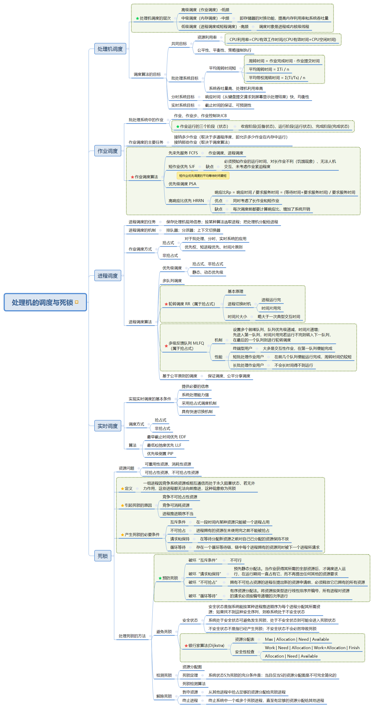
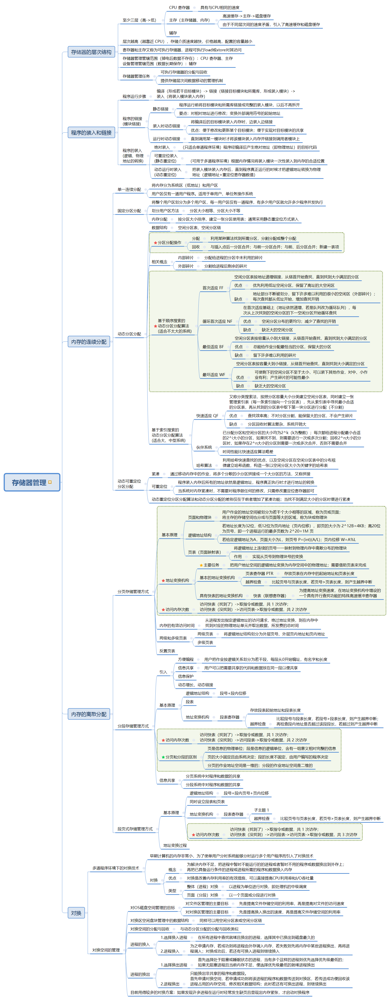

# 操作系统 - 思维导图

## 目录

- [操作系统概论](#操作系统概论)
- [进程与线程](#进程与线程)
- [处理机的调度与死锁](#处理机的调度与死锁)
- [存储器管理](#存储器管理)
- [输入输出设备管理](#输入输出设备管理)
- [文件管理](#文件管理)
- [操作系统接口](#操作系统接口)

## 操作系统概论

## 进程与线程

## 处理机的调度与死锁

## 存储管理

## 输入输出设备管理

## 文件管理

## 操作系统接口

